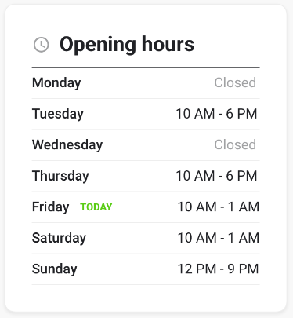

# Context

Project which aims to showcase technical and design knowledge as well as decision making abilities by solving a real-world type scenario.

## To run

Install packages. _Note: in a real world scenario, I would spend time looking at dependency issues_

- `npm install --legacy-peer-deps`
- `npm run start`

The project is published at: [https://reverbeprintemps.github.io/opening-hours/](https://reverbeprintemps.github.io/opening-hours/)

## To test

To run all tests

- `npm run test` then press `a`

For a specific file

- `npm run test <path_to_test_file>`

For a specific test

- `npm run test <path_to_test_file> -t <test_name>`

## Problem

Given a set of opening hours of the following format:

```
{
    "<dayofweek>": "<opening hours>",
    "<dayofweek>": "<opening hours>",
    ...
}
```

The task is to create a reusable component which displays them in an accessible way, following the provided [data requirements](#requirements) and [design guidelines](#design-guidelines).

### Design guidelines


### Desired Output



### Requirements

- Input: JSON-formatted opening hours from a file
- Output: opening hours in a view that is based on provided design and design assets
- With hours in this format: "10 AM - 6 PM" | "Closed"
  - Opening hours must be printed using 12-hour clock. (AM / PM)
  - When closing time overflows to the next day, it is to be shown as a part of the day when a restaurant was opened
- Production level of quality and care
- Deliverable: .ZIP archive

## Assets

- Design guidelines (colors, font sizes, families and line heights).

## Stack

### Frontend

- [React](https://reactjs.org/) as the main framework.
- [Typescript](https://www.typescriptlang.org/) for type safety.

### Backend

- None. Although I considered firing up an [Express JS](https://expressjs.com/) server to emulate data fetching with a bit higher fidelity, but given I like to host my project on [GitHub Pages](https://docs.github.com/en/pages/getting-started-with-github-pages/about-github-pages), it wouldn't work (SPA only). I could've decided to deploy using Netlify or another service but didn't think it would have added much value to the project.
- If I had gone with the server approached, I would've loved to take the opportunity to try my hand at [React Query](https://react-query-v3.tanstack.com/) for things like caching the data. Maybe next time. :)

### Styling

- Used [Material UI](https://mui.com/material-ui/) components and [Material Icons](https://mui.com/material-ui/material-icons/) for their built-in accessibility and because I believed that the components wouldn't take too much custom styling given the provided design had a Material UI icon.
- Went for a CSS-in-JS approach, which I'd never done before, in order to try something new (usually I'd go for run-of-the-mill CSS with [BEM convention](https://en.bem.info/methodology/css/)). Considered [Styled Components](https://styled-components.com/) but decided against it as the small scope of the project wouldn't benefit from it in my opinion.

### Testing

- [Jest](https://jestjs.io/) for assertions and [React Testing Library](https://testing-library.com/) for a neater way to test React components.

### Utils

- [Moment JS](https://momentjs.com/) for neat date formatting.

## Assumptions

- No localization is required
- The data from the server is:
  - Always valid
  - No day will be missing or duplicated
  - Store change type will always be "open" or "close"
  - Time values are UTC+00:00 (ie. GMT)
-

## Approach

1. Created a React/Typescript app using [Create React App (CRA)](https://create-react-app.dev/)
2. My initial drive was to create a test to nail the component's logic first as this would provide robustness to then build and style the component.
   1. I quickly realized that the logic should be extracted from the component and tested separately
3. Focused on figuring out what my dream data structure for the input of my component should look like so I could then focus on the formatter
4. Wrote the formatter by
   1. First capturing happy paths
   2. Then non-happy (ie. special cases) by extrapolating from the existing data and special cases in the provided challenge sheet
5. Wrote a custom hook to handle the fetching of the data
6. Once I had the formatter, the hook and their tests nailed down, I started building the component
7. Once the component was built and tested, I started styling it
8. I then added some additional tests for the useOpeningHours custom hook
9. Wrote JSDocs and README documentation and did a last round of checks to see everything was in order
10. It's time to zip, ship and cross fingers!

# Findings and learnings

Throughout this challenge I have learned many things and reinforced others. Here is a non-exhaustive list of these things, in no particular order:

- Although I do not yet have the TDD mentality or work ethic, this challenge has helped me understand many of its benefits. I think it can be a great approach in cases where you know exactly what kind of input you have and what kind of output you want. However, if there are a few more steps in between (fe. data > formatted data > derived data), it can be slower than the traditional approach. At least this was my experience.
- I love working in DDD (Dream Driven Development). It really helps me make a mental model of the data structures that I want to be working on down the line. If I have to create a component that will have to derive data from a certain input, I will compose the component as though the input data were already in the desired format.
- I'm afraid some of the decisions I've taken have resulted in a couple of convoluted parts, namely both the `reduceToDisplayData` and the `formatOpeningHours` reducers. They both work as intended and produce expected results but I would hope that they would have been more elegant and readable. Even better, I'm sure that I could have avoided them altogether. This is where I believe it would have been extremely valuable to be working in a team where I could have bounced ideas off of others, pair programmed or otherwise simply gotten other eyes and feedback on the code during the PR stage.
- Having no previous experience with Styled Components, I learned a bit about it and considered whether it would be helpful to me in the scope of this assignment. I decided against using it as I was looking for a way to both keep my markup free of styling concerns and less verbose as I believe the MUI components already bloats it a little. That being said I really love the idea of writing _actual_ CSS in a JS file. And I'm sure it has many more benefits which would have made 100% sense in other kinds of projects where there are design tokens and theming.
- Related to the point above, this was my first hand at CSS in JS. Although I absolutely loved defining my global styles, then deriving my local styles from them, and having the power of JS dot notation autocomplete to help, I lacked the autocomplete of CSS attributes. Also, and perhaps most importantly, I'm quite attached to the developer experience of being able to inspect the DOM and understand the purpose of each element through its class name. This also helps when debugging and re/styling things. That being said, I'm sure this preference simply comes from habit and I felt I could get used to a different methodology, provided it was implemented in a way that makes sense.
- Learned a bit more about Typescript, namely when it makes sense to typecast, as well as the [key in Enum] and keyof typeof Enum stuff.
- All in all, it was a really great challenge, fun and full of opportunities to learn and explore. Not too hard && not too easy. I'm glad I took the time to do it. :)

# Notes

## Design

- Took some liberty with how a day with multiple opening/closing cycles shows these times as this was not provided with the designs
  - Picked some arbitrary values of width and spacing as these were not provided
  - With this component, I prioritized a11y, this still allows for responsiveness, but doesn't look great in very small viewports (<350px) with long opening times (ie. XX:XX AM - XX:XX PM) and on a row with the longest competing day name cell (ie. Wednesday + TODAY)
- Regarding responsiveness, I didn't work on making it scale elegantly as I wasn't sure what the scope of such a component would be so decided to stick with the provided design's width but a bit larger to accomodate the longest day name and opening time combination (ie. Wednesday TODAY XX:XX AM - XX:XX PM)

## Could/Would-have-dones

In a real-world scenario, or with a bit more time on my hands, I would've:

- [ ] NPM package dependency errors
- [ ] Actual data fetching + caching
- [ ] Improved loading state
- [ ] More robust tests
- [ ] Error handling
- [ ] Refactor to reduce complexity and increase readability
- [ ] Host on Netlify or similar
